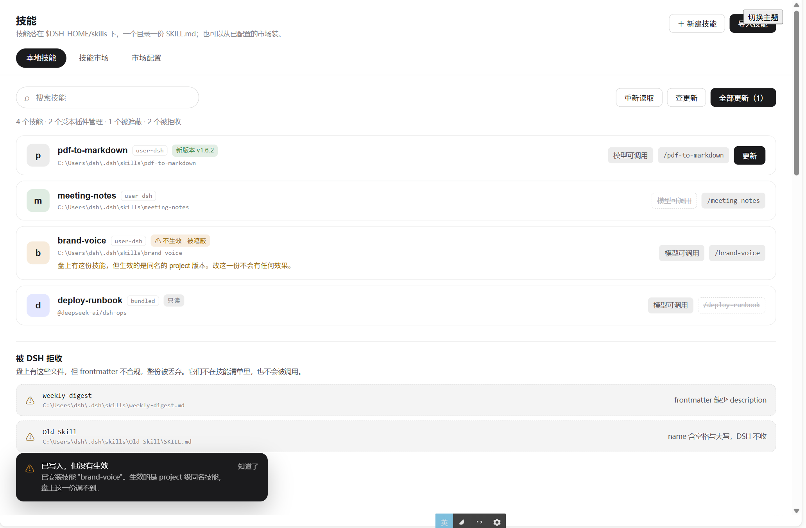
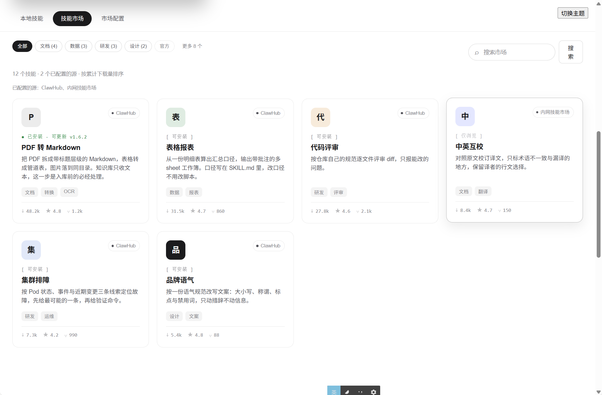

# @staff-os/dsh-workbench

给 DeepSeek Harness 的企业工作台插件：**AI 员工、知识库、技能、MCP 服务、DSH 插件**五块能力，
装上就能用。

**单机运行**——不依赖外部后端，也不需要数据库。所有状态都是 `$DSH_HOME` 下的本地文件。

## 装

```bash
dsh plugin --profile web add @staff-os/dsh-workbench
```

本地开发用绝对路径：

```bash
dsh plugin --profile web add link:E:/path/to/dsh-workbench
```

装完重启 DSH。

## 配

插件自带的 `cordis.patch.yml` 是一层 opt-in patch，默认从环境变量读配置：

| 环境变量 | 作用 |
| --- | --- |
| `DSH_PROFILE` | MCP 与插件管理作用在哪个 profile 上，默认 `web` |
| `CLAWHUB_REGISTRY` | ClawHub 兼容市场的根地址；不配走出厂那一条（ClawHub 官方站，只读接口公开、不要 token） |
| `CLAWHUB_API_KEY` | 市场凭据。**只存引用名，值从凭据服务或启动环境解析，不要内联写进 YAML** |

环境变量放 `$DSH_HOME/.env` 或调用 `dsh` 的那个目录的 `.env`，两层都在启动时读进来
（就近的一层优先，进程里已有的同名变量不被覆盖）。

**换成自建的市场**，改 profile 自己的 patch 层（`$DSH_HOME/profiles/<name>/cordis.patch.yml`）
比改环境变量好：环境变量那条路只能换地址，`id` 与展示名是写死的，界面上会挂着「ClawHub」
的名字指向内网。patch 层是热重载的，改完不用重启：

```yaml
# patch 对 config 是整份替换而不是深合并，所以这一行里每个键都要重述
- id: workbench
  config:
    profile: !!js >-
      process.env.DSH_PROFILE?.trim() || 'web'
    registries:
      - id: skillhub
        name: 内网技能市场
        url: http://10.0.14.55      # 自建部署，与 ClawHub 的 /api/v1 兼容
        flavor: clawhub
        apiKeyEnv: SKILLHUB_REGISTRY_API_KEY   # 匿名可读时可以不写
    registryTimeoutMs: 15000
```

`registries` 是多源聚合：列两条，市场页会一起搜，每张卡片标出自己来自哪个源。`id` 会记进
安装台账，之后的更新检查按它回到同一个源，所以**不要在装过东西之后改 `id`**——改了那些
条目就查不了更新了。

`flavor` 是协议方言，只有两个值：`clawhub`（默认，也适用于任何 ClawHub 兼容的自建部署）
与 `skillhub`（`api.skillhub.cn` 那种把浏览拆成 `/api/v1/showcase/*` 榜单端点、
`/api/v1/skills` 一律 405 的部署）。

要更细的控制就直接改那份 patch，`config` 支持这些字段：

```yaml
- insert:
    - id: workbench
      name: '@staff-os/dsh-workbench'
      config:
        profile: web                # 作用的 profile
        dshHome: ''                 # 覆盖 $DSH_HOME，留空走环境解析
        registries:                 # 多源聚合，技能市场与插件市场共用
          - id: clawhub
            name: ClawHub
            url: https://clawhub.ai
            flavor: clawhub         # clawhub | skillhub
            apiKeyEnv: CLAWHUB_API_KEY
        registryTimeoutMs: 15000    # 单次市场请求
        toolTimeoutMs: 20000        # 本地写操作
        networkToolTimeoutMs: 120000 # 含下载的操作（技能导入、市场安装）
        dshExecutable: dsh          # 插件装卸转发给谁
        pluginToolTimeoutMs: 300000 # 一次 pnpm 安装可能要几十秒
```

## 五个工具

每个域一个工具，用 `action` 参数选具体动作。**破坏性动作必须显式传 `confirm: true`**，
否则直接返回错误、不落盘。

### `workbench_employee` — AI 员工

`list` `get` `create` `update` `bind` `delete`(confirm)

一个 AI 员工就是一个 DSH agent preset。发现、信任级别、复制与删除全部走原生
`ctx.agentPresets`。`create` 只能以一个现成员工为模板**整目录复制**——preset 的创作 API
刻意不接受调用方直接给组合内容，复制出来的东西不会比源多出任何能力。`trust` 为 `system`
的 preset 随部署发布，改不了也删不掉。

`bind` 写的是 preset 目录里的 `employee.yml`，记这个员工该用哪些知识库、技能与 MCP 服务。
**这是职责声明，不是自动装配**：DSH 不会因为绑了知识库就自动检索。绑定指向不存在的资源时，
结果里的 `unknownBindings` 会列出来。

### `workbench_knowledge` — 知识库

`list` `create` `get` `update` `delete`(confirm)
`add_document` `list_documents` `delete_document`(confirm) `search`

检索走 **BM25 关键词**而不是语义向量：DSH 的 `ctx.llm` 只是对话适配器注册表，没有 embedding
能力，单机版没地方拿向量。返回的 `mode` 恒为 `keyword`，与后端在 embedding 不可用时
回退关键词召回的返回形状一致。

中文分词用 CJK 二元字对，**刻意不出一元**——一元看似能提高单字查询召回，实际是让「的」「在」
这类几乎出现在每一块里的字变成可匹配项，任何带虚词的查询都会把全库召回来。

只收文本。PDF、Office 明确报不支持，请先转成 Markdown 或纯文本。

### `workbench_skill` — 技能（本地 + 市场）

本地：`list` `get` `create` `set_visibility` `import` `delete`(confirm)
市场：`market_search` `market_get` `market_install` `market_update` `check_updates`

读路径走原生 `ctx.skills`，因为它含 rank 与同名遮蔽规则。结果里的 `shadowed` 标记「盘上有这份
技能、但被同名的更高优先级来源盖住了」——不标出来的话，「我明明创建了却调不到」会变成一个
查不明白的问题。

**每次写操作都回读一次 `ctx.skills`，报的是那份技能到底生没生效**，而不是一句预测。写完盘
不用重启（理由见下面「技能这一域有三件事不能糊过去」的第三条），但「写成功」与「生效」仍然是两件事：同名遮蔽、
frontmatter 被 DSH 拒收，都会让一次成功的写入落不到实处。

`list` 另外报出**被拒收的文件**：盘上有、但 DSH 因为 frontmatter 不合规整份丢弃的那些。
DSH 那边只有一行日志警告，不在这里说就没有别处会说。

`import` 认本地压缩包路径、下载链接、GitHub 仓库地址与市场 slug。GitHub 页面地址会被翻成
`/tarball` 端点。解包时校验条目数、单文件与整包体积，拒绝 `..`、绝对路径与 NUL；先落**技能根
之外**的暂存目录、校验通过再整目录换上去。

界面走的是另外两条 Remote：**上传**（`importPackage`，在浏览器里挑一个压缩包，字节随一次
调用传上去）与**链接导入**（`importUrl`，把地址交给服务端去下，GitHub 页面地址在同一个
`classifyImportSource` 里翻成 `/tarball`）。两条都与 `import` 共用同一条解包与落盘路径，
区别只有两处——上传单包限 8 MiB（这条路没有分片也没有流式，base64 之后还要涨三分之一，照抄
解包那边的 50 MiB 会把一次调用撑爆），以及**不记安装台账**：手上传或从任意链接取来的包没有
市场坐标，记一条假的进去会让之后的更新检查拿技能名去市场碰一个同名条目，用一个不相干的包
覆盖掉用户自己的东西。

`importUrl` 只收 `http(s)`，本地路径当场拒掉：`import` 那条是给模型的、跑在服务端；Remote
这条是浏览器点一下就发生的，读服务端盘上的任意路径不该由它触发。

**安装出来的目录名以包内 frontmatter 的 `name` 为准**：那才是 DSH 注册出来的身份。

### `workbench_mcp` — MCP 服务

`list` `get` `add` `update` `delete`(confirm) `enable` `disable` `import_json`

MCP 配置就是当前 profile `cordis.patch.yml` 里的 `@deepseek-ai/dsh-mcp-client` 行。读写走
YAML AST 行级操作，注释、其他插件的行与 `!!js` 动态值全部原样保留，写盘前留 `.bak-<ts>` 备份。
**改动在下次启动 DSH 时生效。**

`import_json` 吃 Claude Code / Cursor 风格的 `{"mcpServers": {...}}`，并把 `${VAR}` 转成
`!!js process.env.VAR`——DSH 不做客户端环境替换，不转的话 MCP 服务拿到的 token 就是
`${GITHUB_TOKEN}` 这十几个字符，而且报错发生在远端鉴权阶段，很难回溯。

密钥一律写成 `!!js process.env.变量名`，不要把明文写进配置。

### `workbench_plugin` — DSH 插件（本地 + 市场）

`list` `install` `remove`(confirm) `update` `market_search` `market_install`

底层转发给 `dsh plugin` 命令行（它本身是个 pnpm 转发器），不自己碰 pnpm 也不自己改
`dsh.profile.bundles`。

`list` 把两件事拆开：`isBundle` 说这个包有没有声明 `dsh.bundle`（看的是**装到盘上的那一份**，
一个包可能在新版本才加上），`active` 说它在不在组合层里。装完之后要看这两个标记，
才知道是不是真的装成了插件。

本地路径安装前会读一眼目标的 `package.json`，没有 `dsh.bundle` 就拒绝——把聚合仓库根目录
误当插件装上去，pnpm 会成功、对账会跳过它，最终表现是「装完了但什么都没变」。

**装完要重启 DSH 才生效。**

## 侧栏

插件自带一条 Web 侧栏：常驻 56px 图标 rail 加一列**只属于会话分区**的内容。选中态是实心块
加反色图标。

分区一共六个（会话 / AI 员工 / 知识库 / 技能 / MCP / 插件），但 rail 上**只画
`sections.ts` 里标了 `visible` 的那些**，目前是会话与技能。其余四个的界面还没做完，摆一个
点进去只有一页说明的入口，比不摆更让人以为坏了；它们的工具照常注册、模型照常能用，隐掉的
只是入口。做完一个把它的 `visible` 打开即可，别的地方不用动。

选中会话之外的分区时，内容列不渲染，侧栏缩成那条 rail，该域的界面从 rail 右缘起整幅铺开。
不留一条窄栏是因为它在那些分区里只能摆一份与右边讲同一件事的摘要，既切走一块可用宽度，
又让人先在窄栏里选一次、再到右边选一次。

AppFrame 那条侧栏轨道仍按用户拖出的宽度占着——多出来的那截空底色由管理面板盖住
（overlay 的 z-index 高于侧栏列）。没去改布局 store：`ctx.layout` 只给了 `toggleSidebar()`，
拿它模拟「关上」会跟用户自己的收起状态打架，而且切回会话时未必还原得回去。

它占的是 ui-layout 的 `sidebar` 槽，而**占据即替换**：上游 ui-sidebar 连同它声明的内层座位
一起消失。所以本插件把 `sidebar.workspaces`、`sidebar.settings` 等座位原样重新声明并继续托管，
ui-workspace 与 ui-settings 不用改一行代码。会话分区把内容整块交给 ui-workspace。

`sidebar` 是 single 槽，两个占位方不会报错、只会按注册先后互相遮蔽，结果不确定。所以
`cordis.patch.yml` 里把上游 `ui-sidebar` 停掉了。想保留上游侧栏就删掉那一条，
但那样显示哪一条取决于插件加载顺序，不建议。

## 管理界面

选中会话之外的分区时，主区域整幅出现该域的维护界面；切回会话分区它整个消失，对话界面原样
露出。各域版式统一：一条标题行加一块可滚正文，换域不会跳成另一种页面。

**技能**这一域是完整的维护界面：列表与详情不是弹窗，而是内联覆盖列表，顶部一条
「返回列表」回去。本机清单、技能市场与市场配置三页，切页是一排胶囊——这一页上另外两处可点
的东西（分类筛选、状态角标）也是胶囊，形状统一之后「可点、可切」只有一种长相。

详情页是**两栏**：左边「这是什么」（标题、描述、标签、概览与文件两个页签），右边「它现在
什么状态」（来源、路径、可见性等事实，以及更新与删除）。本机技能与市场条目共用这一套版式，
因为它们讲的是同一种东西，换一栏看就得重新找一遍。市场条目那一栏的头一块是**安全审核结论**，
排在安装按钮之前：装一个技能不是装一个库，SKILL.md 的正文是模型会照着执行的指令。结论本身
不上色——那串字是源给的自由文本，可能是「已通过」也可能是「审核中」或「未通过」，界面不知道
它是好消息还是坏消息，一律涂绿会把后两种说成前一种。

「概览」把 SKILL.md **渲染出来**，用的是宿主的 `MarkdownText`——会话里渲染模型回复的
就是它。不自己引一套 markdown 依赖有两层原因：它已经在客户端加载器的模块表里，插件产物
不用为此胖一圈；更要紧的是它对**不可信内容**是收着的（原始 HTML 与危险协议一律禁掉），
而市场上的 SKILL.md 正是不可信内容。旁边留了一档「源码」：模型读到的是原文而不是渲染
结果，排查一份技能为什么不对劲时要看的是原文。正文过长时先折到 520px，底下一个「展开全文」。

「文件」是一棵**目录树**，目录可折叠、文件带体积，SKILL.md 排在最前。技能包里的路径本来
就是 `references/api.md` 这种形状，摊成一列看不出哪些归在一起。默认全展开——技能包小，
默认折起来的话点进这一页只看得到两三行目录名。

点一个文件就地看内容：markdown 走与正文同一套渲染（预览／源码两档），别的走宿主的
`CodeBlock`，带语法高亮和复制按钮。两件事照实说而不是留空——**二进制**文件的字节压根
不往浏览器送（送了也看不出什么），**超过 256 KiB** 的只送开头一段并说明。市场那边的
文件走同一个弹窗，内容从刚取回来的那个包里翻：网关留**一份**包（8 MiB 以内），顺着一棵
树点下去不会每点一个文件就重下一次整包。

读哪个文件是浏览器说了算的，所以这里有一条安全边界：相对路径先按字面挡掉 `..` 与绝对
路径，解析成绝对路径之后**再核一遍**它确实还在那个技能目录底下。只做前一道不够——路径
分隔符与盘符在不同平台上的写法不止一种，字面检查总有漏网的。这条边界连同「截断之后还
认不认得出是文本」（截口落在汉字中间时，fatal 模式的解码会把一份中文文档判成二进制）
一起由 `tests/file-preview.test.mjs` 守着。

本机侧这棵树列的是**生效的那一份**所在的目录，因此随部署发布的技能也看得到自己的文件，
而不是只有本插件管得着的那些。这里有一处容易踩：`SkillView.path` 在两条投影里指的不是
同一种东西——`projectLocal` 给的是 `<dir>/SKILL.md`，`projectWinner` 给的是那个**目录**。
所以列目录时不看 `path`，直接收 `resourceBase`；而扁平形技能（`<name>.md`）的
`resourceBase` 给的是技能根，照着列会把根下每个技能的文件都算成这一个的，于是只有目录里
确实有 SKILL.md 才当技能目录列。

本机侧有两条入口：**导入**一个现成的技能包（最常见的用法），或从零**新建**一份
SKILL.md。导入那个对话框里摆着四种来源——浏览器上传的压缩包、下载链接、GitHub 仓库地址、
市场 slug——底下是同一条解包与落盘路径，四条分支只在「字节从哪来」这一步不同。**只有市场
slug 那一条记安装台账**：另外三条没有 registry 坐标，记一条假的进去会让之后的更新检查拿技能
名去市场碰一个同名条目，用不相干的包盖掉用户的东西；代价是这三种装法之后不出现在更新检查里。

已装清单是**一行一个**而不是卡片网格：这份清单要回答的是「盘上现在有什么、它生没生效、调不
调得到」，都是逐项对齐着看的事实，网格会把同一列的事实错开。一行里从左到右是四件事，顺序就
是人查这一页的顺序——是谁（首字方牌与名字）、在哪（来源与路径）、怎么调（模型可调用与斜杠
触发两个开关状态；关掉的那个划掉而不是撤掉，只画开着的那个的话「不能调用」与「界面忘了说」
在屏幕上长得一样）、要不要动它（有新版时才出现的更新按钮）。

清单顶上一行数字说清这里都有些什么：一共几个、几个受本插件管理、几个被遮蔽、几个被拒收。
后两个数即使是 0 也照报——它们是这一域最容易让人白忙的两件事，只在非零时才出现的话，人不会
知道界面替他查过。被拒收的那些逐条列在清单**下面**一节虚线框里：它们不是清单折起来的一部分，
而是另一种东西，盘上有、但 DSH 整份丢弃。



有新版本的技能挂一个「新版本 vY」角标，行尾出现一个「更新」；清单自己的工具条上有「查更新」
与「全部更新（N）」。**只有台账里有来源记录的技能才有这几样**——手写的技能没有上游版本可言，
给它挂一个版本号是无中生有，拿它的名字去市场碰一个同名条目装上来更是用一个不相干的包覆盖掉
人自己写的东西。

「查更新」是单独一个按钮而不是并进「重新读取」里：它要走网络问每个源，而重新读取是这一页
最常按的东西，不该每次都等一轮市场往返。一键更新时一条失败不拖累其余，做完把成功与失败
**分别**说清——只报一句「已更新 N 个」而把失败的咽下去，人会以为全都更新了。查不了更新的
（源现在不可达）单独一条横幅列出来，否则界面上的表现是「它就是最新的」，那是一句安静的谎。

市场那边的卡片上**没有安装按钮**，整张卡点进去是详情。这是刻意的：一张卡片放不下决定要
不要装它所需的东西（谁发布的、平台给没给审核结论、包里有什么、静态扫描命中了什么），让「装」
这一下只能在看过那些之后按，比在网格里一路点下去安全。卡上留的是能一眼比较的那几样——哪个源
来的（搜索结果是几个源混在一起的，同一个 slug 在不同源上是不同的包）、它在本机是什么处境
（等宽字的一行：已安装 / 可安装 / 仅浏览，「仅浏览」是别家目录的镜像条目，这个源上没有它的
包），以及下载量、评分与上游 star。

「已安装」只挂在台账认得的那一条上（同一个源、同一个 slug），仅仅是名字撞上的接一句「已有
同名」。两者混成一句的话，「覆盖安装」会看着像更新，实际是拿这个包盖掉另一个来源的同名技能。

市场侧一切过去就先把首页那批取出来，不用先点一次搜索——这一页最常见的用法是「先看看有什么」，
而不是心里已经有个名字。留空浏览时这一批按**累计下载量**重排（热门的在前，这也是打开市场首页
想看到的）；带关键词搜出来的那一批保持市场给的次序，那是相关度，按下载量重排会把最贴题的一条
压到第二屏去。结果行上写着当前按的是哪一种，不写死一句——写死的话其中一种情况下它就是假的。



市场条目的详情与本机技能同一组页签，「概览」是那份 SKILL.md 的正文，「文件」是包里有哪些
文件、各多大。这两样是**把包取回来**得到的，不是问市场要一份目录：SkillHub 有一组
`/api/web/skills/.../files` 端点，但它不在 ClawHub 兼容契约里（同样的路径在 clawhub.ai 上
是 404），而下载端点是安装本来就要走的那一个，所以这里列出来的就是装上去会得到的东西。
取不到（镜像条目、转发到 GitHub 的条目、源不可达）时两个页签照实说明原因，不弹失败——
人只是想看看这是什么，不是在装它。

搜索框左边是一条**标签分组**，点一个标签只看归在它下面的条目。两者摆在同一行，因为它们是
同一件事的两种收窄方式，分成上下两条会让人以为要先选一个再搜。它有两种来路，摆出来的只
会是其中一条：

- **市场自己的标签目录**（SkillHub 的 `/api/web/labels`）。有它的时候按标签筛是**服务端**
  做的，覆盖整个市场而不只是当前这一页——内网那台就有一套自定义标签（`skillhub`、`5g-dpi`、
  `aiintelligence` 一类），点一个得到的是整个市场里的全部命中。标签是各源自己的东西，所以
  筛的时候只问它所属的那个源：拿一个源的标签去问另一个源，要么 404、要么被无视之后回一整页
  没筛过的结果，后者看着像筛过了，比报错更坏。
- **从已载入的这批结果里数出来的分类**（条目自带的 `topics`）。源不提供标签目录时才用它，
  下面跟一句话说清范围，免得「某分类只有三条」被当成整个市场只有三条。

两种都没有时整条不出现，而不是摆一个只有「全部」的空壳。和文件清单一样，`/api/web/labels`
不在 ClawHub 兼容契约里（clawhub.ai 上是 404），所以这是尽力探测：取不到就当这个源没有标签。

按标签筛走的是 `/api/web/skills`，它的条目形状与 `/api/v1` 那两条都不同——显示名与摘要各有
一个中文版，版本在 `headlineVersion` 里，统计量换了一套字段名，所以单有一条归一路径。顺带
的好处是筛出来的卡片会显示中文名。**`namespace` 不是发布者**：它是 `global` 这样的命名空间，
当成 owner 会让卡片上写着「发布者 global」，下载时还会带上一个上游不认的坐标。

**AI 员工**域的界面（列表加六页编辑面板）代码仍在，只是入口暂时隐掉了，见上面「侧栏」
一节；知识库 / MCP / 插件三域还只有说明面板。这四域的工具照常注册，模型照常能用。

界面上的每一项都是本机实际数据：员工来自 `ctx.agentPresets`，绑定来自 preset 目录里的
`employee.yml`，人设与工具读自 agent 组合文件；技能清单来自 `ctx.skills` 与
`$DSH_HOME/skills` 的合并。随部署发布（`trust` 非 `user`）的员工、以及不在用户目录里的
技能，在界面上一律只读，与工具那边同一条规则。

### 技能这一域有四件事不能糊过去

**一是被遮蔽。** `ctx.skills` 回答的是「模型现在能用什么」（含 rank 与同名遮蔽规则），
用户目录回答的是「本插件改得动什么」。同名时高优先级来源会盖住用户级——盘上那份仍然
存在、却不生效。界面把它标成「被遮蔽」，并在详情页顶上给一条横幅说明改它没有任何效果，
而不是做成一个容易被忽略的小角标。

**二是被 DSH 拒收。** 技能的 frontmatter 有几条不宽容的规矩：`name` 必填且必须是
kebab-case；两个可见性开关必须写成短横线形式（`disable-model-invocation`、`user-invocable`），
写成驼峰会让 DSH **抛错并丢弃整份技能**。Claude Code 生态的技能包里驼峰写法不少，装上去
之后表现是「一切正常但模型完全看不见它」。所以本插件按 DSH 的规则逐条复刻了一遍解析，
把这些文件单独列出来并说清该改成什么。

**三是写完之后到底生没生效。** 这里早先写的是「重启 DSH 后生效」——对着上游源码核过，
这句话是错的，而且会让人白白重启一次。真实的链路是：`dsh-skill-filesystem` 用 chokidar
盯着技能根，写完约 200ms 后调用 `control.invalidate()`，那个回调清掉整个 registry 的发现
缓存并广播 `skills/change`；`dsh-tool-skill` 在**每一个** `agent/pre-step` 重新取快照、
digest 变了就往会话里追加一条替换目录；用户那条 `/name` 调用路径更直接，它每次都现查
`ctx.skills.get(name)`，完整定义根本不进缓存。**写完盘，下一个模型回合就生效。**

本插件还在这条链路上加了两手：自己在 `ctx.skills` 上注册一个不产出任何技能的 provider，
只为拿到那个失效句柄，写完主动敲一下（watcher 被关掉或起不来时同样成立）；然后回读一次
`ctx.skills`，把「现在这个名字在不在、赢的是不是我刚写的那份」作为结果交出去。

这句结论浮在界面左下角，不占版面——原先它是夹在页签与列表之间的一条横幅，会把整份列表往下
推一截，装完一个技能之后刚才在看的那一行就跑了位置，而人这时候多半正想接着装下一个。生效了
的那种过几秒自己消失；**没生效的那种不会**，要人自己点掉：那句话意味着刚才那下白做了。

回读有一处必须说清楚，否则那句结论会骗人：`ctx.skills` 是「宿主层 + 每个作用域一层」的
分层注册表，而本插件挂在**宿主层**、是个无作用域的上下文。**web profile 的出厂组合把宿主层的
`skill-filesystem` 关掉了**，本地技能的发现改由每个 agent preset 在自己那一层挂
（`packages/bundle/web-app/cordis.patch.yml` 里写了理由：本地发现归预设所有）。于是从这里
看过去，`$DSH_HOME/skills` 下的技能一个都查不到——而会话里那个 agent 照常能用。所以
「查不到」被拆成三种成因分别作答：这一份被拒收（给出具体是哪个键）、宿主层根本不扫这个根
（说明是预设作用域的事，不是没生效）、以及两者都不是（老实说不知道，请去看 DSH 的日志）。
headless profile 里宿主层自己挂 `skill-filesystem`，回读就是直接有效的。

**四是这一份里有没有明显不该有的东西。** 技能是会被模型照着做的一份指令，装之前值得
先看一眼。详情页（本机与市场各一份）有一页「安全扫描」：十三条正则规则，外加一条
「字符集夹带」——盘上是合法 UTF-8、按 UTF-16 重新解一次却能读出另一段文字的，多半是
故意藏进去的。规则表与那条解码判法移植自腾讯朱雀实验室的
[AI-Infra-Guard](https://github.com/Tencent/AI-Infra-Guard)（Apache License 2.0）的
skill-scan 预扫描，内网 SkillHub 的发布前置校验用的是同一份规则的 Java 版，两边因此
说的是同一件事。

这一页刻意**不给一个红绿灯**：命中只说明「这段文字长得像某种高危写法」，不代表这份技能
真会那么做——`crontab` 出现在一份讲定时任务的文档里完全正常，一份红队技能的越狱语料里
当然全是提示词注入。所以摆出来的是「哪条规则、在哪个文件哪一行」，点一条就打开那个文件
自己看。反过来也一样：没命中不等于安全，规则只有十三条。

### 一个员工是什么

一个 AI 员工不是一张名片，而是**人设 + 工具 + 技能 + MCP + 知识库**凑成的一个可直接
对话的智能体模板。名片（`preset.yml`）只有名字和简介，真正决定这个员工能干什么的是
`agent.cordis.yml`——一份 cordis loader 的条目数组，每行装一个插件，可以用
`cordis:group` 套娃。

所以界面展示的东西是从那份文件**解析**出来的（[`employee/composition.ts`](src/employee/composition.ts)），
而不是另建一套记录：另建一套会立刻开始与组合文件不一致，而组合文件才是唯一说了算的
那个。四个内置模式的差别因此一眼可见——`minimal` 是 2 个工具插件加一段固定系统提示，
`standard` 是 17 个工具插件、支持技能、读 AGENTS.md，`cordis` 比它多一个。

有三件事界面上照实写了，这里也记一笔：

- **分类是按包名前缀的启发式**，不是 DSH 的正式分类。DSH 没给插件打「我是工具」的标记，
  能依据的只有命名约定（`dsh-tool-*` / `dsh-skill*` / `dsh-mcp*`）。认不出来的行一律进
  「其他组成」原样列出，而不是猜。
- **一个工具行不等于一个工具名。** `dsh-tool-fs` 一行会注册好几个文件操作工具，真正的
  工具名要到运行时才定。界面给的是「装了哪些工具插件」。
- **`disabled` 是 `!!js` 表达式时原样显示**（例如按平台禁用），到底禁不禁用要看运行环境，
  不替它判断。

两个「人设」在界面上是分开的两块，因为它们不是一回事：组合文件里 `dsh-persona` 的
**系统提示**决定这个智能体开口时是谁（只读，改它要动组合文件）；工作台写在
`employee.yml` 里的**岗位说明**是另加的一层，说明以这个员工身份工作时负责什么。把后者
说成"人设"会让人以为改了它就改了系统提示，其实没有。

同理，技能与 MCP 两页先说这个模板**本身支不支持**该类资源（读自组合文件），再给绑定
清单：`minimal` 压根没装技能能力，给它绑一堆技能，绑定是写进去了，模型却根本没有调用
技能的工具。

这些信息模型也看得到：`workbench_employee` 的 list 输出里有一行「组成」，与界面读的是
同一份投影（[`employee/view.ts`](src/employee/view.ts)）。

### 它落在哪个槽

面板占的是 `shell.overlay`（list 槽，frame 级浮层），**不是** `conversation`。后者是 single
槽且被 ui-conversation 占着，占它等于自己重写整个对话界面。overlay 是 list，加一份不排挤
任何人。代价是 overlay 层盖住整个 frame，所以面板要自己让开侧栏那一列——宽度由侧栏写进
两边共享的状态盒子（侧栏与面板是两棵不相邻的 React 树，context 跨不过去）。

### 数据通道

浏览器读本机文件只有一条正规路径：Typert Remote。本包的 Node 半边把
`WorkbenchEmployeeGateway` 注册为 `ctx.workbenchEmployee`，`@Remote` 标出的方法经
api-gateway 暴露成 `ctx.remote.workbenchEmployee.*`——与 DSH 自己的
`ui-settings-plugin-inventory` 读插件清单是同一套机制。

两件事值得单独记一笔，改这块之前先读：

- **`src/typert-schemas.ts` 是手写的。** DSH 自己的同类产物由
  `@deepseek-ai/dsh-typert-generator` 从源码类型生成，而那个生成器按 harness 的 workspace
  布局发现包，仓库外的独立插件跑不了它。loader 只认 `package.json#exports` 的 `./typert`
  与产物里的 `TYPERT` 形状，所以这里按同一份产物契约手写。**代价**：这份 schema 与
  `employee/remote.ts` 的类型没有编译期联系，改了方法签名这里不会报错，而是运行时被
  gateway 的 strict 校验挡下来。改一个必须改另一个。
- **Node 半边的构建吃 `tsc` emit 出来的 JS，不是 `.ts` 源。** `@Remote` 装饰器必须由 tsc
  转译成运行时代码；tsdown 底下的 oxc 会把装饰器语法原样吐出来，Node 加载即语法错误。
  所以 `build` 是 `tsc -b && tsdown`，中间产物在 `.tsbuild/`。

手写这份表还有两处只有踩过才知道的规矩：

- **方法名不能叫 `remove`。** 浏览器侧每个命名空间是一个 Service，它原型上就有 `remove`，
  重名会在 `$mount` 时被拒。两个域的删除方法都叫 `delete`。
- **可选参数要写 `acceptsUndefined: true`。** api-gateway 收到调用时按 descriptor 逐字核对
  参数名，而 `undefined` 在 JSON 里根本不存在——传一个 undefined 的可选参数，到网关那边
  就是「少了一个字段」，整个调用被拒。schema 那边写 `.optional()` 管不了这件事，开关在参数
  descriptor 上。

## 数据落在哪

```
$DSH_HOME/
├── skills/<name>/SKILL.md              技能（DSH 原生的用户级技能根）
├── workbench/skills.json               已装技能的来源台账（更新检查靠它）
├── workbench/staging/                  装包时的暂存目录，刻意不在技能根内
├── profiles/<profile>/cordis.patch.yml MCP 服务（DSH 原生的 profile patch 层）
├── .agent-presets/<id>/                AI 员工（DSH 原生的 preset 根）
│   ├── agent.cordis.yml                  组合，DSH 拥有
│   ├── preset.yml                        展示元数据，DSH 拥有
│   └── employee.yml                      资源绑定，本插件附加
└── workbench/
    ├── knowledge/<kb-id>/
    │   ├── kb.json                       元数据与分块参数
    │   ├── documents/<doc-id>.<ext>      原文
    │   └── index.json                    分块正文与词频
    └── cache/                            市场结果的离线缓存
```

文件权限一律 owner-only（`0600` / `0700`）：patch 与知识库可能含 token 或企业内容。

## 明确不做

- **向量检索**。DSH 没有 embedding 能力缝，做不了就不假装能做
- **PDF / Office 解析**。不预先引重量级依赖，需要就先转成文本
- **绕过 preset 的复制边界**。`ctx.agentPresets` 只允许整目录复制，这是刻意的安全设计

## 开发

```bash
pnpm install
pnpm build        # 两半一起出：Node 半边 lib/index.js，浏览器半边 lib/client.js
pnpm typecheck    # tsc -b
pnpm test         # node --test
```

客户端产物没法用 DSH 的 client 预设（它 glob harness 仓库找包，仓库外的插件查无此名），
所以 `tsdown.client.ts` 按同一份产物契约自己实现了一遍：`__ModuleLoader__.load` 闭包、
CJS/browser、固定 `client.js`、CSS 模块经 lightningcss 编译，以及只有加载器模块表里的说明符
能保持 external。

改动那份配置之后要核对产物：

```bash
grep -o 'require("[^"]*")' lib/client.js | sort -u
```

只应出现模块表里的说明符。多出别的就是运行时必炸的 require。
