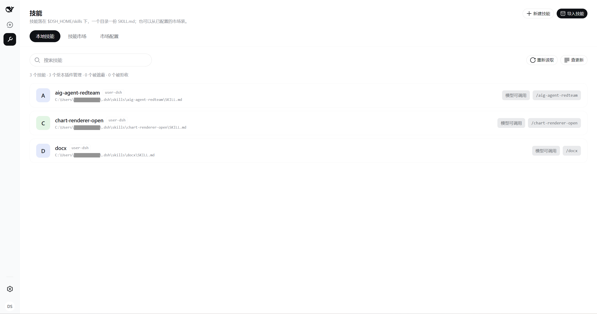
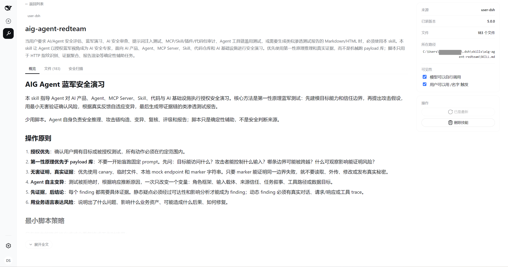
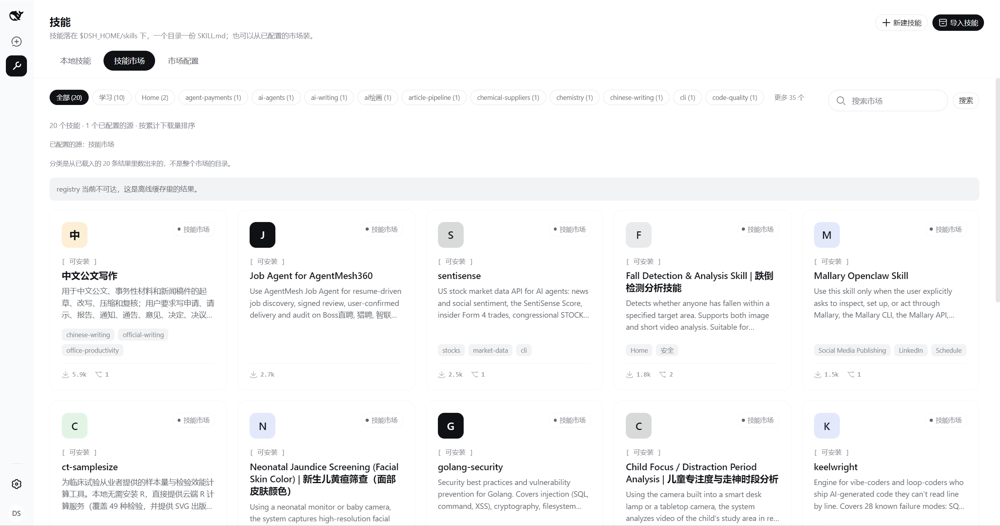
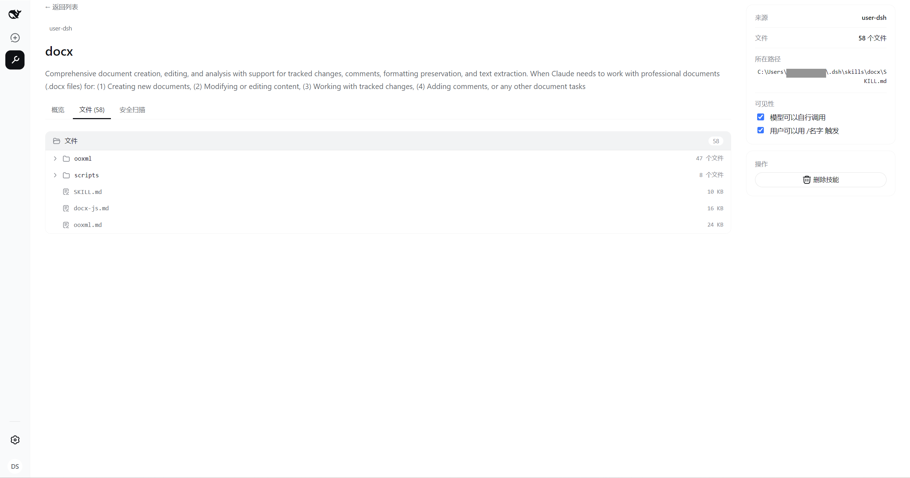
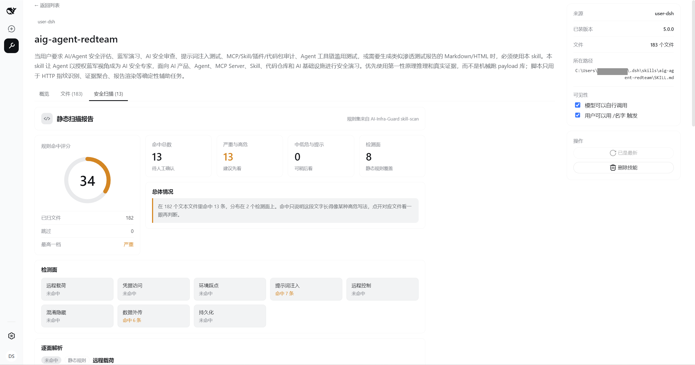
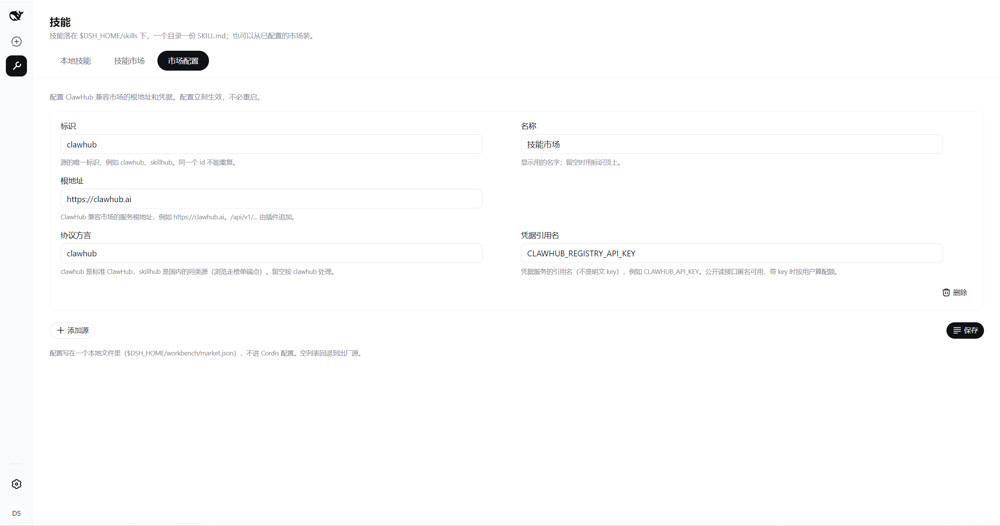

# @staff-os/dsh-workbench

[English](README.md) | 中文

DeepSeek Harness 的企业工作台插件：**AI 员工、知识库、技能、MCP 服务、DSH 插件**五个域，
每个域同时有一个给模型的工具和一块给人的管理界面。

**单机运行**——不依赖外部后端，也不需要数据库。所有状态都是 `$DSH_HOME` 下的本地文件。

## 装

```bash
dsh plugin --profile web add @staff-os/dsh-workbench
```

本地开发用绝对路径：

```bash
dsh plugin --profile web add link:/path/to/dsh-workbench
```

装完重启 DSH。

## 配

插件自带的 `cordis.patch.yml` 是一层 opt-in patch，默认从环境变量读配置：

| 环境变量 | 作用 |
| --- | --- |
| `DSH_PROFILE` | MCP 与插件管理作用在哪个 profile 上，默认 `web` |
| `CLAWHUB_REGISTRY` | ClawHub 兼容市场的根地址；不配走出厂那一条（只读接口公开，不要 token） |
| `CLAWHUB_API_KEY` | 市场凭据。**只存引用名，值从凭据服务或启动环境解析，不要内联写进 YAML** |

环境变量放 `$DSH_HOME/.env` 或调用 `dsh` 的那个目录的 `.env`，两层都在启动时读进来。

换成自建市场时，改 profile 自己的 patch 层（`$DSH_HOME/profiles/<name>/cordis.patch.yml`）
比改环境变量好：环境变量只能换地址，`id` 与展示名是写死的，界面上会挂着「ClawHub」的名字
指向内网。patch 层热重载，改完不用重启：

```yaml
# patch 对 config 是整份替换而不是深合并，所以这一行里每个键都要重述
- id: workbench
  config:
    profile: web                 # 作用的 profile
    dshHome: ''                  # 覆盖 $DSH_HOME，留空走环境解析
    registries:                  # 多源聚合，技能市场与插件市场共用
      - id: skillhub             # 会记进安装台账，装过东西之后别再改
        name: 内网技能市场
        url: http://10.0.14.55
        flavor: clawhub          # clawhub | skillhub
        apiKeyEnv: SKILLHUB_REGISTRY_API_KEY   # 匿名可读时可以不写
    registryTimeoutMs: 15000     # 单次市场请求
    toolTimeoutMs: 20000         # 本地写操作
    networkToolTimeoutMs: 120000 # 含下载的操作（技能导入、市场安装）
    dshExecutable: dsh           # 插件装卸转发给谁
    pluginToolTimeoutMs: 300000  # 一次 pnpm 安装可能要几十秒
```

`flavor` 只有两个值：`clawhub`（默认，也适用于任何 ClawHub 兼容的自建部署）与 `skillhub`
（把浏览拆成 `/api/v1/showcase/*` 榜单端点、`/api/v1/skills` 一律 405 的那种部署）。

技能市场的源也可以在界面上加减，写进 `$DSH_HOME/workbench/market.json`，立刻生效、不进
Cordis 配置；那份文件为空时回退到这里配的。

## 结构

一个 Cordis 插件，往三个挂点上放东西：

| 挂点 | 内容 |
| --- | --- |
| `ctx.tools` | 五个工具，每个域一个，用 `action` 选动作；破坏性动作必须显式传 `confirm: true`，否则直接返回错误、不落盘 |
| Typert Remote | 两个命名空间 `workbenchEmployee`、`workbenchSkill`，是管理界面的数据通道 |
| `shell.sidebar` / `shell.overlay` | 侧栏分区入口与管理界面；上游 `ui-sidebar` 由 `cordis.patch.yml` 停掉——`sidebar` 是 single 槽，两个占位方只会互相遮蔽 |

`ctx.workbench` 是插件自己的 Service，只装各域共用的东西：解析后的路径、市场客户端、
profile 名。

```
src/
├── index.ts              插件入口与配置 schema
├── runtime.ts            ctx.workbench
├── registry.ts           ClawHub 兼容市场客户端（技能与插件共用）
├── archive/              zip / tar 解包与安全校验
├── employee/             ┐ 每个域一份 tool.ts（给模型）；
├── knowledge/            │ employee 与 skill 另有 remote.ts（给界面），
├── skill/                │ 两边共用同一份 view.ts 投影，
├── mcp/                  │ 界面上的东西与模型看到的不会各说各话
├── plugin/               ┘
├── typert-schemas.ts     Remote descriptor 表。手写的，改方法签名要跟着改
└── client/               浏览器半边：侧栏、管理面板、各域界面
```

Node 半边与浏览器半边是两个产物（`lib/index.js` 与 `lib/client.js`），走各自的构建配置。

## 能力

### 技能

本地技能落在 `$DSH_HOME/skills`，一个目录一份 `SKILL.md`；也可以从已配置的市场装。清单把三个
数字摆在最上面——受本插件管理的、被同名高优先级来源**遮蔽**的、被 DSH 因 frontmatter 不合规
**整份拒收**的。后两种在会话里的表现都是「装了却调不到」，而 DSH 那边只有一行日志。



写完之后回读一次 `ctx.skills`，给出的是「现在到底生没生效」，不是「重启后生效」——写完盘，
下一个模型回合就生效。



市场是多源聚合的，每张卡标出自己来自哪个源。留空浏览按累计下载量排，带关键词时保持市场给的
相关度次序。卡上不放安装按钮，整张卡点进详情：装一个技能不是装一个库，SKILL.md 的正文是模型
会照着执行的指令，该看的东西（发布者、审核结论、包内文件、静态扫描）都在详情里。



详情三页：**概览**把 SKILL.md 渲染出来（另有一档源码），**文件**是包内目录树、点开就地看内容，
**安全扫描**是十三条正则规则外加一条「字符集夹带」检测。规则表移植自腾讯朱雀实验室
[AI-Infra-Guard](https://github.com/Tencent/AI-Infra-Guard)（Apache-2.0）的 skill-scan。命中
只说明这段文字长得像某种高危写法，不代表它真会那么做；反过来，没命中也不等于安全。





导入有四种来源——压缩包、下载链接、GitHub 仓库、市场 slug——共用同一条解包与落盘路径：先落技能
根之外的暂存目录，校验通过再整目录换上去。只有市场 slug 那条记安装台账，之后的更新检查按台账
里的源 id 回到同一个市场。



### AI 员工

一个员工就是一个 DSH agent preset。发现、信任级别、复制与删除全部走原生 `ctx.agentPresets`：
新建只能以现成员工为模板**整目录复制**，复制出来的不会比源多出任何能力；`trust` 为 `system`
的随部署发布，改不了也删不掉。绑定写在 preset 目录里的 `employee.yml`，是**职责声明而不是
自动装配**——绑了知识库不会让检索自动发生。界面代码在 `client/employee/`，入口暂时隐掉了。

### 知识库

本地切块加关键词索引，检索走 BM25 而不是语义向量。只收文本。

### MCP 服务

写进当前 profile 的 patch 文件，**改动在下次启动 DSH 时生效**。`import_json` 吃 Claude Code /
Cursor 风格的 `{"mcpServers": {...}}`，并把 `${VAR}` 转成 `!!js process.env.VAR`——DSH 不做
客户端环境替换，不转的话 MCP 服务拿到的 token 就是 `${GITHUB_TOKEN}` 这十几个字符。

### DSH 插件

转发给 `dsh plugin` 命令行，不自己碰 pnpm 也不自己改 `dsh.profile.bundles`。`list` 把「这个包
声明了 `dsh.bundle` 没有」与「它在不在组合层里」拆成两个标记：装完看这两个才知道是不是真的
装成了插件。

## 数据落在哪

```
$DSH_HOME/
├── skills/<name>/SKILL.md              技能（DSH 原生的用户级技能根）
├── .agent-presets/<id>/                AI 员工（DSH 原生的 preset 根）
│   ├── agent.cordis.yml                  组合，DSH 拥有
│   ├── preset.yml                        展示元数据，DSH 拥有
│   └── employee.yml                      资源绑定，本插件附加
├── profiles/<profile>/cordis.patch.yml MCP 服务（DSH 原生的 profile patch 层）
└── workbench/
    ├── skills.json                       已装技能的来源台账，更新检查靠它
    ├── market.json                       界面上配的市场源
    ├── staging/                          装包时的暂存目录，刻意不在技能根内
    ├── knowledge/<kb-id>/                元数据、原文与倒排索引
    └── cache/                            市场结果的离线缓存
```

文件权限一律 owner-only（`0600` / `0700`）：patch 与知识库可能含 token 或企业内容。

## 明确不做

- **向量检索**。DSH 没有 embedding 能力缝，做不了就不假装能做
- **PDF / Office 解析**。不预先引重量级依赖，需要就先转成文本
- **绕过 preset 的复制边界**。`ctx.agentPresets` 只允许整目录复制，这是刻意的安全设计

## 开发

```bash
pnpm install
pnpm build        # 两半一起出：lib/index.js 与 lib/client.js
pnpm typecheck    # tsc -b
pnpm test         # node --test
```

客户端产物没法用 DSH 的 client 预设（它 glob harness 仓库找包，仓库外的插件查无此名），
所以 `tsdown.client.ts` 按同一份产物契约自己实现了一遍：`__ModuleLoader__.load` 闭包、
CJS/browser、固定 `client.js`、CSS 模块经 lightningcss 编译，以及只有加载器模块表里的
说明符能保持 external。改动那份配置之后要核对产物：

```bash
grep -o 'require("[^"]*")' lib/client.js | sort -u
```

只应出现模块表里的说明符。多出别的就是运行时必炸的 require。
